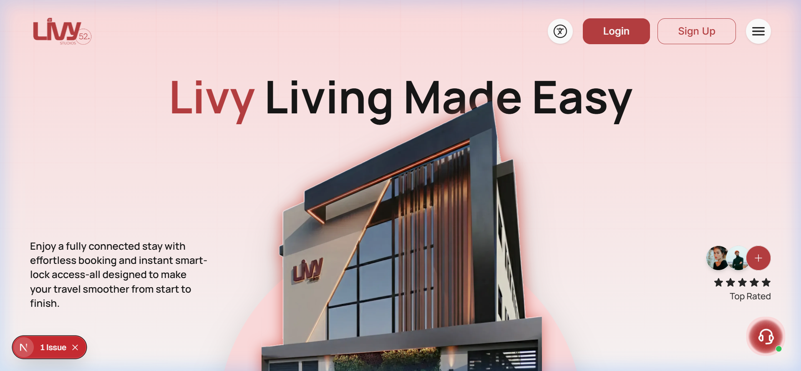

# 🏠 LivyStay - Premium Property Booking Made Simple

[](https://livystay-website.vercel.app/)
[](https://nextjs.org/)
[](https://tailwindcss.com/)
[](https://www.typescriptlang.org/)



LivyStay is a modern, responsive property booking platform built for a seamless user experience. Whether you're looking for a cozy apartment or a luxury villa, LivyStay connects you with your next destination.

---

## ✨ Features

- 🔍 **Advanced Search**: Find properties based on location, dates, and guest capacity.
- 🖼️ **Property Gallery**: High-quality visual exploration of properties with responsive grids.
- 🔐 **Secure Authentication**: Complete auth flow including Signup, Login, and Password recovery.
- ❤️ **Favorites**: Save your favorite properties for later.
- 📅 **Booking Management**: Easy-to-use interface for managing your stays and history.
- 📱 **Fully Responsive**: Optimized for desktop, tablet, and mobile devices.
- 🎨 **Premium UI/UX**: Smooth animations with AOS and modern design principles.

---

## 🛠️ Tech Stack

- **Framework**: [Next.js 15 (App Router)](https://nextjs.org/)
- **Styling**: [Tailwind CSS 4](https://tailwindcss.com/)
- **State Management**: [TanStack Query (React Query)](https://tanstack.com/query/latest)
- **Forms & Validation**: [React Hook Form](https://react-hook-form.com/) & [Zod](https://zod.dev/)
- **Animations**: [AOS (Animate On Scroll)](https://michalsnik.github.io/aos/) & [GSAP](https://gsap.com/)
- **Icons**: [Lucide React](https://lucide.dev/) & [Remix Icon](https://remixicon.com/)
- **HTTP Client**: [Axios](https://axios-http.com/)

---

## 🚀 Getting Started

### Prerequisites

- Node.js (Latest LTS version recommended)
- npm or yarn or pnpm

### Installation

1. **Clone the repository**
   ```bash
   git clone https://github.com/your-username/livystay.git
   cd livy-app
   ```

2. **Install dependencies**
   ```bash
   npm install
   ```

3. **Set up Environment Variables**
   Create a `.env.local` file in the root directory and add your API base URL:
   ```env
   NEXT_PUBLIC_API_BASE_URL=https://your-api-endpoint.com/api
   ```

4. **Run the development server**
   ```bash
   npm run dev
   ```
   Open [http://localhost:3000](http://localhost:3000) in your browser to see the result.

### Build for Production

```bash
npm run build
npm start
```

---

## 📁 Project Structure

```text
src/
├── app/            # Next.js App Router (Pages & Layouts)
├── components/      # Reusable UI components
├── hooks/          # Custom React hooks
├── lib/            # External library configurations (Axios, React Query)
├── providers/       # React Context providers
├── store/          # State management stores
├── types/          # TypeScript interfaces and types
└── validations/     # Zod schemas for form validation
```

---

## 🌐 Live Link

Check out the live application here: **[LivyStay Website](https://livystay-website.vercel.app/)**

---

## 📄 License

This project is private and proprietary.
